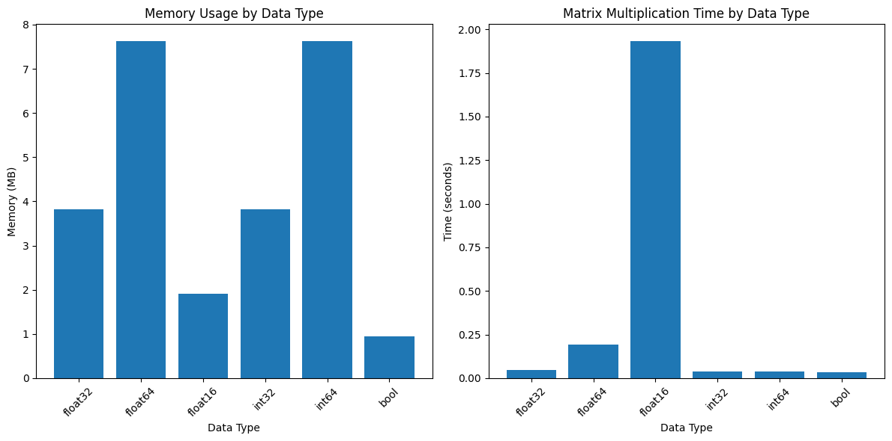

# PyTorch: Autograde and Internal Graphs

---

## Project Structure

```
.
├── custom_layers.py         # Custom layers for CNN and Transformer
├── custom_transformer.py    # Custom Transformer Model
├── custom_cnn.py            # Custom CNN Model
├── README.md                # README file
├── ModelsCustomLayers.ipynb # Notebook for training CNN and Transformer
```

## CNN Training Logs
```bash
Epoch 1/1
------------------------------------------------------------
Train Epoch: 0 [0/60000 (0%)]	Loss: 2.325208
Train Epoch: 0 [6400/60000 (11%)]	Loss: 2.274367
Train Epoch: 0 [12800/60000 (21%)]	Loss: 1.907985
Train Epoch: 0 [19200/60000 (32%)]	Loss: 1.327141
Train Epoch: 0 [25600/60000 (43%)]	Loss: 1.174399
Train Epoch: 0 [32000/60000 (53%)]	Loss: 0.865014
Train Epoch: 0 [38400/60000 (64%)]	Loss: 0.571349
Train Epoch: 0 [44800/60000 (75%)]	Loss: 0.953678
Train Epoch: 0 [51200/60000 (85%)]	Loss: 0.636638
Train Epoch: 0 [57600/60000 (96%)]	Loss: 0.530873
```

## Transformer Training Logs

```bash
Training on cpu
Batch 0, Loss: 31946.1055
Batch 10, Loss: 28276.4121

Epoch completed. Average loss: 29259.5110
```

---

## Visualizing Computational Graphs

The below code is a simple example of how to visualize a computational graph using PyTorch. It will create a computational_graph.png file in the current directory.

```bash
# Install torchviz
!pip install torchviz
```

```python
import torch
import numpy as np
import matplotlib.pyplot as plt
from torch.autograd import Function, grad, gradcheck
import time
import graphviz
from torchviz import make_dot

def visualize_with_graphviz():
    x = torch.tensor(2.0, requires_grad=True)
    a = x ** 2
    b = torch.sin(a)
    c = torch.exp(b)
    y = c * x

    # Create visualization
    dot = make_dot(y, params={"x": x})
    dot.render("computational_graph", format="png")

    print("""
    Computational Graph Visualization:
    - Nodes represent operations (functions)
    - Edges represent data flow
    - Leaf nodes are inputs
    - Root node is the output
    - Gradient flows backward through this graph
    """)

    # Show intermediate values and gradients
    y.backward()
    print("\nForward Pass Values:")
    print(f"x = {x.item():.4f}")
    print(f"a = x² = {a.item():.4f}")
    print(f"b = sin(a) = {b.item():.4f}")
    print(f"c = exp(b) = {c.item():.4f}")
    print(f"y = c * x = {y.item():.4f}")

    print("\nBackward Pass Gradients:")
    print(f"dy/dx = {x.grad.item():.4f}")

visualize_with_graphviz()
```

```python
class ComputationGraphVisualizer:
    def __init__(self):
        self.nodes = []
        self.edges = []
        self.node_attrs = {}

    def trace_tensor(self, tensor: torch.Tensor, name: str = "output"):
        """Traces a tensor's computation graph."""
        def add_node(node, name: str):
            if node not in self.nodes:
                self.nodes.append(node)
                if hasattr(node, 'variable'):
                    self.node_attrs[node] = f"{name}\n{tuple(node.variable.shape)}"
                else:
                    self.node_attrs[node] = f"{name}\n{type(node).__name__}"

        def add_parents(node):
            if hasattr(node, 'next_functions'):
                for parent in node.next_functions:
                    if parent[0] is not None:
                        self.edges.append((parent[0], node))
                        add_node(parent[0], "intermediate")
                        add_parents(parent[0])

        if tensor.grad_fn is not None:
            add_node(tensor.grad_fn, name)
            add_parents(tensor.grad_fn)

    def visualize(self, filename: str = "computation_graph"):
        """Creates a visual representation of the graph."""
        dot = Digraph()
        dot.attr(rankdir='LR')  # Left to right layout

        # Add nodes
        for node in self.nodes:
            dot.node(str(id(node)), self.node_attrs[node])

        # Add edges
        for src, dst in self.edges:
            dot.edge(str(id(src)), str(id(dst)))

        dot.render(filename, format='png', cleanup=True)

def demonstrate_graph_construction():
    # Simple computation
    x = torch.tensor([2.0], requires_grad=True)
    y = torch.tensor([3.0], requires_grad=True)

    # Build computation graph
    z = x * y
    w = torch.sin(z)
    v = torch.exp(w)
    f = v * x

    # Visualize graph
    visualizer = ComputationGraphVisualizer()
    visualizer.trace_tensor(f, "final_output")
    visualizer.visualize("basic_computation")

    print("""
    Graph Construction Steps:
    1. x * y → Creates multiplication node
    2. sin(z) → Adds sine operation
    3. exp(w) → Adds exponential
    4. v * x → Connects back to input

    Note how each operation creates a new node and edges.
    """)

demonstrate_graph_construction()
```


## Custom Autograd Functions

```python
from torch.autograd import Function, grad, gradcheck

class CustomReLU(Function):
    @staticmethod
    def forward(ctx, input):
        ctx.save_for_backward(input)
        return input.clamp(min=0)

    @staticmethod
    def backward(ctx, grad_output):
        input, = ctx.saved_tensors
        grad_input = grad_output.clone()
        grad_input[input < 0] = 0
        return grad_input

# Test custom ReLU
custom_relu = CustomReLU.apply
x = torch.randn(5, requires_grad=True)
y = custom_relu(x)
print(f"Input: {x.data}")
print(f"Output: {y.data}")

# Compute gradients
z = y.sum()
z.backward()
print(f"Gradients: {x.grad}")
```


## Higher Order Gradients

```python
def compute_higher_order():
    x = torch.tensor([2.0], requires_grad=True)

    # First derivative of x^3
    def first_derivative(x):
        return 3 * x**2

    # Second derivative of x^3
    def second_derivative(x):
        return 6 * x

    # Compute using autograd
    y = x**3
    first_grad = grad(y.sum(), x, create_graph=True)[0]
    second_grad = grad(first_grad.sum(), x)[0]

    print(f"Function: x^3")
    print(f"First derivative at x=2: {first_grad.item()} (Expected: {first_derivative(x).item()})")
    print(f"Second derivative at x=2: {second_grad.item()} (Expected: {second_derivative(x).item()})")

compute_higher_order()
```


## Gradient Clipping

```python
def demonstrate_gradient_clipping():
    # Create a simple neural network
    model = torch.nn.Sequential(
        torch.nn.Linear(10, 10),
        torch.nn.ReLU(),
        torch.nn.Linear(10, 1)
    )

    # Generate random data
    x = torch.randn(32, 10)
    y = torch.randn(32, 1)

    # Function to print gradient norms
    def print_grad_norms():
        total_norm = 0
        for p in model.parameters():
            if p.grad is not None:
                param_norm = p.grad.data.norm(2)
                total_norm += param_norm.item() ** 2
        total_norm = total_norm ** 0.5
        return total_norm

    # Training loop with different clipping methods
    optimizers = {
        'No Clipping': torch.optim.SGD(model.parameters(), lr=1.0),
        'Norm Clipping': torch.optim.SGD(model.parameters(), lr=1.0),
        'Value Clipping': torch.optim.SGD(model.parameters(), lr=1.0)
    }

    for name, optimizer in optimizers.items():
        # Forward pass
        output = model(x)
        loss = (output - y).pow(2).mean()

        # Backward pass
        optimizer.zero_grad()
        loss.backward()

        # Print original gradients
        print(f"\n{name}:")
        print(f"Original gradient norm: {print_grad_norms():.4f}")

        if name == 'Norm Clipping':
            # Clip gradient norm to 1.0
            torch.nn.utils.clip_grad_norm_(model.parameters(), max_norm=1.0)
            print(f"After norm clipping: {print_grad_norms():.4f}")

        elif name == 'Value Clipping':
            # Clip gradient values to [-0.5, 0.5]
            torch.nn.utils.clip_grad_value_(model.parameters(), clip_value=0.5)
            print(f"After value clipping: {print_grad_norms():.4f}")

        optimizer.step()

demonstrate_gradient_clipping()
```


## Rotary Position Embeddings (RoPE)

Rotary position embedding (RoPE) is a technique used in transformer models to encode positional information into the input embeddings, particularly for sequential data like text or time series. It modifies the way attention mechanisms handle positions in a sequence, improving efficiency and scalability for certain types of tasks.

Here’s a breakdown of RoPE:

### 1. **Purpose of Positional Embeddings**

Transformers do not inherently encode the order of tokens in a sequence. Positional embeddings introduce order information so that models can distinguish between tokens based on their positions.

### 2. **How RoPE Works**

RoPE represents positional information by rotating the token embeddings in a high-dimensional space. Each dimension of the embedding is rotated by an angle proportional to the token's position in the sequence. Mathematically:

- Each token embedding is treated as a complex number (or as part of a 2D plane for each pair of dimensions).
- A rotation matrix is applied to encode the relative position between tokens.

The rotation matrix is derived using a sinusoidal function similar to the sinusoidal positional encoding used in original transformers but is implemented differently. Specifically, RoPE allows embeddings to represent relative positions, which is useful for many tasks.

### 3. **Advantages of RoPE**

- **Relative Position Awareness:** Unlike standard positional embeddings, RoPE encodes relative positional information, making it more effective for tasks like language modeling or autoregressive generation.
- **Scalability:** RoPE can efficiently handle sequences of varying lengths, as its rotational encoding doesn’t depend on the absolute position.
- **Improved Attention Dynamics:** By introducing relative positional relationships directly into the attention mechanism, RoPE can improve the model's ability to focus on relevant parts of the input.

### 4. **Applications**

RoPE has been used in models like GPT-3 and its variants to improve performance, especially in tasks involving long-context sequences. It’s particularly useful in settings where capturing relative position (e.g., distances or patterns) is more critical than absolute positions.

```python
class RotaryEmbedding(nn.Module):
    """
    Implements Rotary Position Embeddings (RoPE).
    RoPE applies rotation to key and query vectors based on their positions.
    """

    def __init__(self, dim: int, max_seq_len: int = 2048):
        super().__init__()
        self.dim = dim
        inv_freq = 1.0 / (10000 ** (torch.arange(0, dim, 2).float() / dim))
        position = torch.arange(max_seq_len)
        sincos = torch.einsum('i,j->ij', position, inv_freq)
        self.register_buffer('sin', sincos.sin())
        self.register_buffer('cos', sincos.cos())

    def forward(self, x: torch.Tensor) -> torch.Tensor:
        """Apply rotary embeddings to input tensor."""
        # Handle input with shape [B, L, num_heads, head_dim]
        if x.ndim == 4:
            B, L, num_heads, head_dim = x.shape
            assert head_dim % 2 == 0, "Head dimension must be even for RoPE"

            # Reshape input for rotation
            x_reshape = x.view(B, L, num_heads, -1, 2)  # [B, L, num_heads, head_dim//2, 2]

            # Prepare sin and cos for broadcasting
            sin = self.sin[:L, None, None, :].expand(L, B, num_heads, head_dim // 2).permute(1, 0, 2, 3)
            cos = self.cos[:L, None, None, :].expand(L, B, num_heads, head_dim // 2).permute(1, 0, 2, 3)

            x1 = x_reshape[..., 0]  # Even indices
            x2 = x_reshape[..., 1]  # Odd indices

            # Apply RoPE rotation
            rotated = torch.stack([
                x1 * cos - x2 * sin,
                x1 * sin + x2 * cos
            ], dim=-1)

            return rotated.flatten(-2)  # Restore shape to [B, L, num_heads, head_dim]

        # Handle input with shape [B, L, D]
        elif x.ndim == 3:
            B, L, D = x.shape
            assert D % 2 == 0, "Embedding dimension must be even for RoPE"

            # Reshape input for rotation
            x_reshape = x.view(B, L, -1, 2)  # [B, L, D//2, 2]

            # Prepare sin and cos for broadcasting
            sin = self.sin[:L, None, :].expand(L, B, D // 2).permute(1, 0, 2)  # [B, L, D/2]
            cos = self.cos[:L, None, :].expand(L, B, D // 2).permute(1, 0, 2)  # [B, L, D/2]

            x1 = x_reshape[..., 0]  # Even indices
            x2 = x_reshape[..., 1]  # Odd indices

            # Apply RoPE rotation
            rotated = torch.stack([
                x1 * cos - x2 * sin,
                x1 * sin + x2 * cos
            ], dim=-1)

            return rotated.flatten(-2)  # Restore shape to [B, L, D]

        else:
            raise ValueError(f"Unsupported input shape: {x.shape}")

def visualize_rope_embeddings():
    """Visualize how RoPE affects vector representations."""
    dim = 64
    seq_len = 10
    rope = RotaryEmbedding(dim)

    # Create sample vectors
    x = torch.randn(1, seq_len, dim)  # [1, 10, 64]
    x_rotated = rope(x)  # [1, 10, 64]

    # Reshape tensors for visualization
    x_vis = x[0].detach().numpy()  # [10, 64]
    x_rotated_vis = x_rotated[0].detach().numpy()  # [10, 64]

    # Option 1: Aggregate across embedding dimensions
    x_vis_agg = x_vis.mean(axis=-1)  # [10] (mean along embedding dimensions)
    x_rotated_vis_agg = x_rotated_vis.mean(axis=-1)  # [10]

    # Option 2: Select specific embedding dimensions for visualization
    x_vis_slice = x_vis[:, :32]  # [10, 32]
    x_rotated_vis_slice = x_rotated_vis[:, :32]  # [10, 32]

    # Option 3: Combine dimensions into a 2D array
    x_vis_combined = x_vis.reshape(seq_len, -1)  # [10, 64]
    x_rotated_vis_combined = x_rotated_vis.reshape(seq_len, -1)  # [10, 64]

    # Create visualization
    fig, (ax1, ax2) = plt.subplots(1, 2, figsize=(15, 5))

    # Plot original embeddings
    im1 = ax1.imshow(x_vis_combined, aspect='auto', cmap='viridis')
    ax1.set_title('Original Vectors')
    ax1.set_xlabel('Flattened Dimensions')
    ax1.set_ylabel('Sequence Position')
    plt.colorbar(im1, ax=ax1)

    # Plot rotated embeddings
    im2 = ax2.imshow(x_rotated_vis_combined, aspect='auto', cmap='viridis')
    ax2.set_title('Rotated Vectors (RoPE)')
    ax2.set_xlabel('Flattened Dimensions')
    ax2.set_ylabel('Sequence Position')
    plt.colorbar(im2, ax=ax2)

    plt.tight_layout()
    plt.savefig('rope_visualization.png')
    plt.show()

visualize_rope_embeddings()
```


## Cached Attention

**CachedAttention** refers to a technique or optimization commonly used in transformer-based models to improve the efficiency of attention computation, particularly during inference in autoregressive models like GPT. The key idea is to reuse or **cache** computations from previous steps instead of recalculating them, significantly reducing redundancy.

### 1. **Context: Attention in Transformers**

In a transformer, the **attention mechanism** computes a weighted representation of input tokens based on their pairwise relationships. For each token, it calculates:

- **Query (Q):** Represents the current token's features.
- **Key (K):** Encodes information about all tokens in the sequence.
- **Value (V):** Encodes the actual content of the tokens.

During autoregressive decoding (e.g., generating text one token at a time), the model processes a sequence incrementally. Without caching, the attention mechanism recalculates keys and values for the entire sequence at each step, which is computationally expensive.

------

### 2. **What CachedAttention Does**

CachedAttention addresses this inefficiency by **caching the keys and values** computed in previous steps. When generating the next token:

- The model uses the cached keys and values from previous tokens.
- It computes the query for the current token and attends to the cached keys/values.
- This avoids recomputing the keys and values for the entire sequence, saving time and resources.

------

### 3. **Key Benefits**

- **Speed:** Reduces the computational cost of attention during inference, enabling faster token-by-token generation.
- **Memory Efficiency:** Prevents recalculation of redundant information, optimizing memory usage.
- **Scalability:** Particularly useful for long sequences, where recalculating attention weights for all tokens becomes prohibitive.

------

### 4. **Implementation Insight**

Here’s a simplified outline of how CachedAttention works:

1. During the initial forward pass, the model computes and stores keys and values for the sequence up to that point.
2. During subsequent steps:
   - The cached keys and values are retrieved.
   - The query for the new token is computed and used to attend to the cached keys and values.
   - The new key and value for the current token are added to the cache.

------

### 5. **Applications**

CachedAttention is commonly used in:

- **Large Language Models (LLMs):** For efficient autoregressive generation in models like GPT and T5.
- **Real-Time Systems:** Where latency is critical, such as chatbots or on-device text generation.
- **Streaming Data Applications:** Where models process data sequentially and incrementally.

```python
class CachedAttention(nn.Module):
    """
    Implements attention mechanism with KV caching for efficient inference.
    """

    def __init__(self, dim: int, num_heads: int):
        super().__init__()
        self.dim = dim
        self.num_heads = num_heads
        self.head_dim = dim // num_heads

        # Single matrix for Q, K, V projections
        self.qkv = nn.Linear(dim, 3 * dim)
        self.rope = RotaryEmbedding(self.head_dim)

        # Initialize KV cache
        self.cache_k = None
        self.cache_v = None

    def forward(
        self,
        x: torch.Tensor,
        use_cache: bool = False,
        clear_cache: bool = False
    ) -> torch.Tensor:
        """Forward pass with optional KV caching."""
        B, L, D = x.shape

        # Clear cache if requested
        if clear_cache:
            self.cache_k = None
            self.cache_v = None

        # QKV projections
        qkv = self.qkv(x)
        q, k, v = qkv.chunk(3, dim=-1)

        # Reshape for multi-head attention
        q = q.view(B, L, self.num_heads, self.head_dim)
        k = k.view(B, L, self.num_heads, self.head_dim)
        v = v.view(B, L, self.num_heads, self.head_dim)

        # Apply RoPE to queries and keys
        q = self.rope(q)
        k = self.rope(k)

        # Update KV cache
        if use_cache:
            if self.cache_k is None:
                self.cache_k = k
                self.cache_v = v
            else:
                self.cache_k = torch.cat([self.cache_k, k], dim=1)
                self.cache_v = torch.cat([self.cache_v, v], dim=1)
            k, v = self.cache_k, self.cache_v

        # Scaled dot-product attention
        scale = 1.0 / math.sqrt(self.head_dim)
        attn = torch.matmul(q, k.transpose(-2, -1)) * scale
        attn = F.softmax(attn, dim=-1)

        # Combine heads
        out = torch.matmul(attn, v)
        out = out.reshape(B, L, D)

        return out

def demonstrate_kv_cache():
    print("\nDemonstrating KV Cache:")

    model = CachedAttention(dim=64, num_heads=4)

    # Generate sample sequence
    x = torch.randn(1, 10, 64)

    # Without cache
    start_time = time.time()
    out1 = model(x, use_cache=False)
    time1 = time.time() - start_time

    # With cache
    start_time = time.time()
    out2 = model(x, use_cache=True)
    time2 = time.time() - start_time

    print(f"Time without cache: {time1:.4f}s")
    print(f"Time with cache: {time2:.4f}s")
    print(f"Speedup: {time1/time2:.2f}x")

demonstrate_kv_cache()
```


## Memory 

## Profiling for different datatypes

```bash
!pip install memory_profiler
```

```python
import torch
import numpy as np
import psutil
import sys
import time
import matplotlib.pyplot as plt
from memory_profiler import profile
import pandas as pd
from torch.utils.benchmark import Timer
from typing import List, Tuple, Dict

import pandas as pd
from timeit import Timer
from time import perf_counter

def analyze_datatypes():
    """
    Analyze memory usage and computation speed for various data types in PyTorch.
    """
    size = (1000, 1000)  # Matrix size

    float_types = {
        'float32': torch.float32,
        'float64': torch.float64,
        'float16': torch.float16,
    }
    int_types = {
        'int32': torch.int32,
        'int64': torch.int64,
        'bool': torch.bool
    }

    results = []

    # Analyze floating-point types
    for name, dtype in float_types.items():
        tensor = torch.randn(size, dtype=dtype)  # Random tensor

        # Measure memory usage
        memory = tensor.element_size() * tensor.nelement() / (1024 * 1024)  # Memory in MB

        # Measure computation time
        start_time = perf_counter()
        for _ in range(100):  # Perform 100 iterations
            torch.matmul(tensor, tensor)
        end_time = perf_counter()

        speed = (end_time - start_time) / 100  # Average time per operation

        results.append({
            'dtype': name,
            'memory_mb': memory,
            'matmul_time': speed
        })

    # Analyze integer types
    for name, dtype in int_types.items():
        if dtype == torch.bool:
            tensor = torch.randint(0, 2, size, dtype=dtype)  # Boolean tensor
        else:
            tensor = torch.randint(0, 100, size, dtype=dtype)  # Integer tensor

        # Measure memory usage
        memory = tensor.element_size() * tensor.nelement() / (1024 * 1024)  # Memory in MB

        # Measure computation time (convert to float for matmul)
        start_time = perf_counter()
        for _ in range(100):  # Perform 100 iterations
            torch.matmul(tensor.float(), tensor.float())
        end_time = perf_counter()

        speed = (end_time - start_time) / 100  # Average time per operation

        results.append({
            'dtype': name,
            'memory_mb': memory,
            'matmul_time': speed
        })

    # Convert results to DataFrame for display
    df = pd.DataFrame(results)
    print("\nData Type Analysis Results:")
    print(df)

    # Visualize the results
    plt.figure(figsize=(12, 6))

    # Memory usage plot
    plt.subplot(1, 2, 1)
    plt.bar(df['dtype'], df['memory_mb'])
    plt.title('Memory Usage by Data Type')
    plt.ylabel('Memory (MB)')
    plt.xlabel('Data Type')
    plt.xticks(rotation=45)

    # Computation time plot
    plt.subplot(1, 2, 2)
    plt.bar(df['dtype'], df['matmul_time'])
    plt.title('Matrix Multiplication Time by Data Type')
    plt.ylabel('Time (seconds)')
    plt.xlabel('Data Type')
    plt.xticks(rotation=45)

    # Save and show plots
    plt.tight_layout()
    plt.savefig('datatype_analysis_fixed.png')
    print("\nVisualization saved as 'datatype_analysis_fixed.png'.")
    plt.show()

# Call the function
analyze_datatypes()
```




## Memory Allocation Patterns:

### Continuous vs Fragmented Memory:   

- Continuous: Single large block of memory 

- Fragmented: Multiple small blocks scattered in memory 

  

#### Benefits of Continuous:

- Faster memory access (better cache utilization) 
- Less memory overhead 
- Better hardware optimization 


#### Drawbacks of Fragmented: 

- Cache misses   

- Memory overhead from bookkeeping   

- Slower access patterns 

  

#### Memory Usage Comparison: 

- Continuous allocation size: 3.81 MB 
- Fragmented allocation size: 3.91 MB


## MemoryStats

```python
@dataclass
class MemoryStats:
    allocated: float
    cached: float
    reserved: float

class GraphExecutionProfiler:
    def __init__(self):
        self.memory_stats = []
        self.execution_times = []

    def measure_memory(self) -> MemoryStats:
        if torch.cuda.is_available():
            return MemoryStats(
                allocated=torch.cuda.memory_allocated() / 1024**2,
                cached=torch.cuda.memory_cached() / 1024**2,
                reserved=torch.cuda.memory_reserved() / 1024**2
            )
        return MemoryStats(0, 0, 0)

    def profile_execution(self, func, *args, **kwargs):
        start_mem = self.measure_memory()
        start_time = time.time()

        result = func(*args, **kwargs)

        end_time = time.time()
        end_mem = self.measure_memory()

        self.memory_stats.append((start_mem, end_mem))
        self.execution_times.append(end_time - start_time)

        return result

    def report(self):
        print("\nExecution Profile:")
        for i, ((start_mem, end_mem), exec_time) in enumerate(zip(self.memory_stats, self.execution_times)):
            print(f"\nIteration {i+1}:")
            print(f"Execution time: {exec_time*1000:.2f}ms")
            print(f"Memory allocated: {end_mem.allocated - start_mem.allocated:.2f}MB")
            print(f"Memory cached: {end_mem.cached - start_mem.cached:.2f}MB")

def demonstrate_graph_execution():
    profiler = GraphExecutionProfiler()

    def complex_computation(x: torch.Tensor, depth: int) -> torch.Tensor:
        for _ in range(depth):
            x = torch.relu(torch.matmul(x, x))
        return x

    # Profile different graph sizes
    sizes = [100, 200, 400]
    for size in sizes:
        x = torch.randn(size, size, requires_grad=True)
        profiler.profile_execution(complex_computation, x, depth=3)

    profiler.report()

demonstrate_graph_execution()
```

```bash
# Output

Execution Profile:

Iteration 1:
Execution time: 0.94ms
Memory allocated: 0.00MB
Memory cached: 0.00MB

Iteration 2:
Execution time: 6.16ms
Memory allocated: 0.00MB
Memory cached: 0.00MB

Iteration 3:
Execution time: 43.64ms
Memory allocated: 0.00MB
Memory cached: 0.00MB
```

